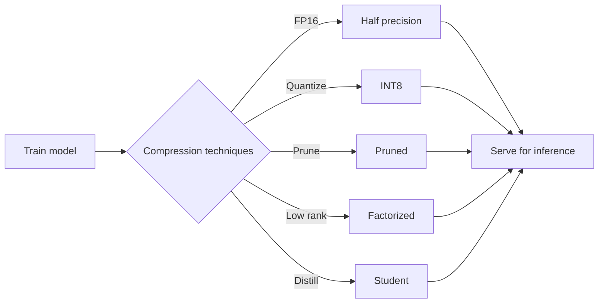
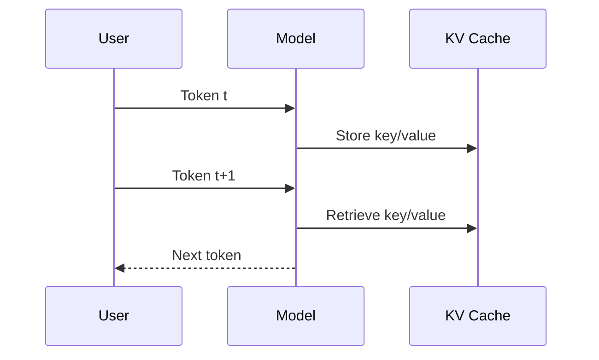

# quantize

Demonstrates strategies to compress a PyTorch model for efficient inference and showcases optimizations like operator fusion and key‑value caching.

Below you’ll find an in‑depth overview of the major concepts used throughout the project along with diagrams that illustrate how the pieces fit together.

## Environment

Install runtime and development dependencies with [uv](https://github.com/astral-sh/uv):

```bash
uv sync --group dev
```

## Scripts

| Script | Description | Command |
| --- | --- | --- |
| `train.py` | Train a model and export several compressed variants. | `uv run python train.py` |
| `fusion.py` | Load `model.pth` and write a TorchScript‑fused version. | `uv run python fusion.py` |
| `kv_cache.py` | Demonstrate key‑value cache usage in attention. | `uv run python kv_cache.py` |

## Compression and inference techniques

| Technique | How it works | Notes |
| --- | --- | --- |
| FP16 weights | Cast parameters to 16‑bit floats before saving. | Halves storage requirements. |
| Dynamic quantization | Convert `Linear` layers to INT8 at inference. | Limited layer support, small accuracy hit. |
| Structured pruning | Remove channels using `ln` structured pruning. | May need fine‑tuning to recover accuracy. |
| Low‑rank factorization | Replace linear layers with low‑rank pairs. | Choose rank to balance size vs. error. |
| Knowledge distillation | Train smaller student to mimic teacher. | Requires extra training time. |
| Operator fusion | TorchScript combines adjacent ops. | Model must be in evaluation mode. |
| KV‑cache | Reuse attention keys/values for decoding. | Trades memory for speed on long sequences. |

### Concept details

#### FP16 weights
Casting model parameters from 32‑bit to 16‑bit floating point (FP16) halves the storage and bandwidth requirements. The reduced precision can introduce small numerical errors, but for many inference workloads the accuracy drop is negligible and the savings in memory and throughput are substantial.

#### Dynamic quantization
Dynamic quantization converts certain layers (typically `nn.Linear`) to lower‑precision integer operations at inference time. Weights are stored as INT8 and scaled back to floating point during execution. This technique requires no retraining and yields significant speedups on CPU at the cost of a minor accuracy reduction.

#### Structured pruning
Structured pruning removes entire channels or neurons based on a criterion such as the `ln` norm of weights. By eliminating groups of parameters instead of individual weights, the resulting model can exploit sparsity more effectively on hardware that supports it. Pruned models may require fine‑tuning to regain lost accuracy.

#### Low‑rank factorization
Low‑rank factorization decomposes a weight matrix into the product of two smaller matrices. Choosing a low rank reduces both the number of parameters and the compute cost. The rank must be carefully selected to balance model size and approximation error.

#### Knowledge distillation
Knowledge distillation trains a smaller “student” network to mimic a larger “teacher” model by matching its logits or intermediate representations. The student inherits much of the teacher’s performance while using fewer parameters, though it requires an additional training phase.

#### Operator fusion
Operator fusion combines adjacent operations into a single optimized kernel. In this project we leverage TorchScript to fuse operations when the model is in evaluation mode. Fused graphs reduce kernel launch overhead and improve cache locality.

#### Key‑value cache
Transformer decoders repeatedly attend over the previously generated tokens. A key‑value (KV) cache stores the keys and values from earlier time steps so that each new token only computes attention against new data. This trades additional memory for lower latency on long sequences.

### Workflow overview

The following diagram summarizes the path from training through the various compression strategies to deployment:



### KV‑cache flow

The KV‑cache reuses stored attention components during autoregressive decoding:



## Development

Run unit tests with:

```bash
uv run pytest
```

Lint and format staged files using pre‑commit:

```bash
uv run pre-commit run --files <files>
```

These checks also run automatically in GitHub Actions.

