# quantize

Demonstrates strategies to compress a PyTorch model for efficient inference and showcases optimizations like operator fusion and key‑value caching.

Below you’ll find an in‑depth overview of the major concepts used throughout the project along with diagrams that illustrate how the pieces fit together.

## Environment

Install runtime and development dependencies with [uv](https://github.com/astral-sh/uv):

```bash
uv sync --group dev
```

## Scripts

| Script | Description | Command |
| --- | --- | --- |
| `train.py` | Train a model and export several compressed variants. | `uv run python train.py` |
| `fusion.py` | Load `model.pth` and write a TorchScript‑fused version. | `uv run python fusion.py` |
| `kv_cache.py` | Demonstrate key‑value cache usage in attention. | `uv run python kv_cache.py` |

## Compression and inference techniques

| Technique | How it works | Notes |
| --- | --- | --- |
| FP16 weights | Cast parameters to 16‑bit floats before saving. | Halves storage requirements. |
| Dynamic quantization | Convert `Linear` layers to INT8 at inference. | Limited layer support, small accuracy hit. |
| Structured pruning | Remove channels using `ln` structured pruning. | May need fine‑tuning to recover accuracy. |
| Low‑rank factorization | Replace linear layers with low‑rank pairs. | Choose rank to balance size vs. error. |
| Knowledge distillation | Train smaller student to mimic teacher. | Requires extra training time. |
| Operator fusion | TorchScript combines adjacent ops. | Model must be in evaluation mode. |
| KV‑cache | Reuse attention keys/values for decoding. | Trades memory for speed on long sequences. |

### Concept details

#### FP16 weights
Casting model parameters from 32‑bit to 16‑bit floating point (FP16) halves storage and memory bandwidth. Each parameter is rounded to the closest FP16 value before being saved. At inference the model reads the FP16 tensors directly, cutting the amount of data moved through the system while keeping arithmetic in floating point.

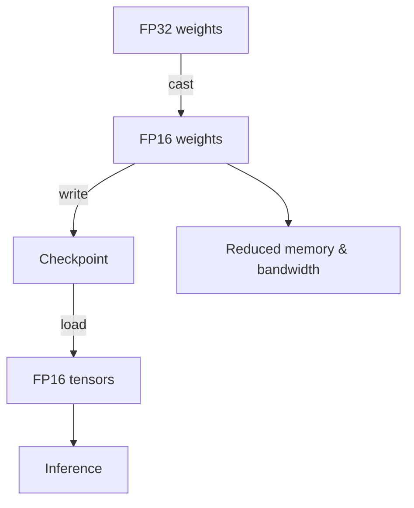

#### Dynamic quantization
Dynamic quantization converts layers such as `nn.Linear` to integer arithmetic on‑the‑fly. Before the model runs, weights are mapped from floating point to INT8 along with a scale factor and zero point. At runtime activations are quantized, an INT8 matrix multiply executes, and the result is scaled back to FP32. No retraining is required and CPU inference often becomes faster with only a small accuracy loss.

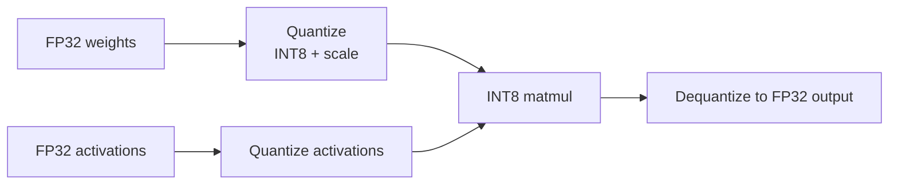

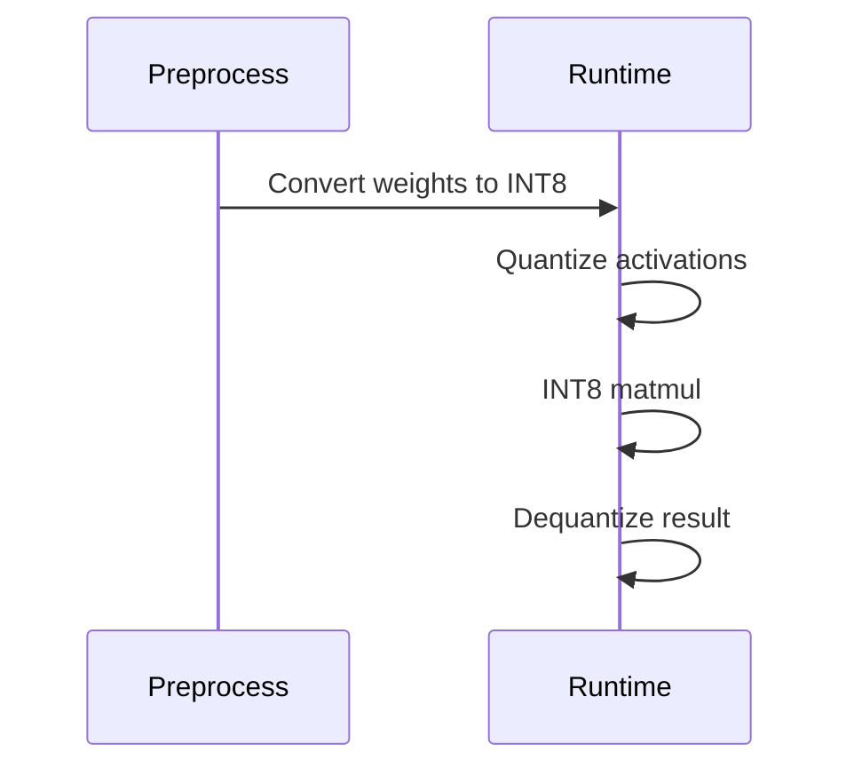

#### Structured pruning
Structured pruning removes whole channels or neurons using a criterion such as the `ln` norm of each channel's weights. Channels whose norm falls below a threshold are deleted, yielding a smaller dense layer. Because complete structures disappear, many accelerators can realize speedups without specialized sparse kernels, though fine‑tuning is often needed to recover accuracy.

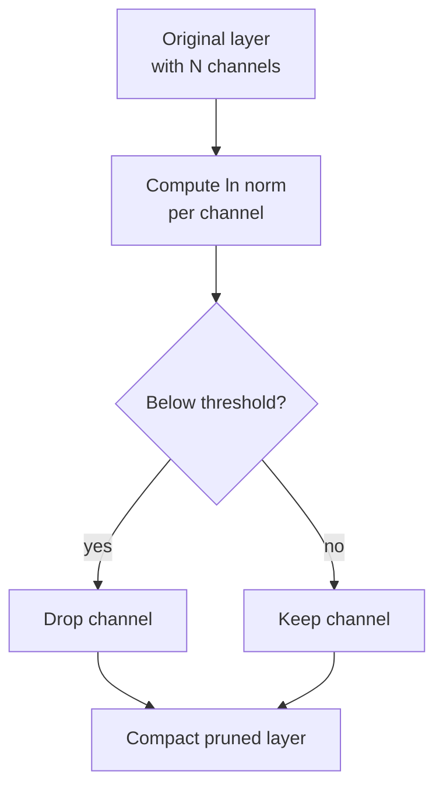

#### Low‑rank factorization
Low‑rank factorization replaces a large weight matrix with the product of two smaller matrices. If the original matrix has shape `m x n`, it can be approximated by matrices `U (m x r)` and `V (r x n)` where `r` is much smaller than `m` or `n`. The input is first multiplied by `U` and then by `V`, reducing both parameters and multiply‑adds. Choosing `r` trades accuracy for efficiency.

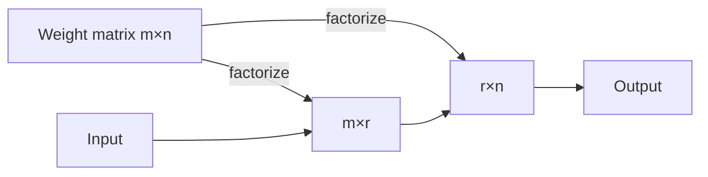

#### Knowledge distillation
Knowledge distillation trains a compact "student" network under the guidance of a larger "teacher" model. The teacher processes training data to produce soft targets. The student learns from both the ground‑truth labels and the teacher's outputs, typically by minimizing a weighted combination of the standard loss and a distillation loss. The extra training phase transfers performance from teacher to student.

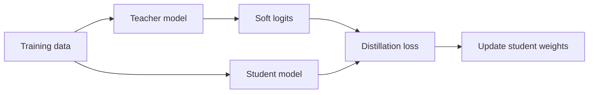

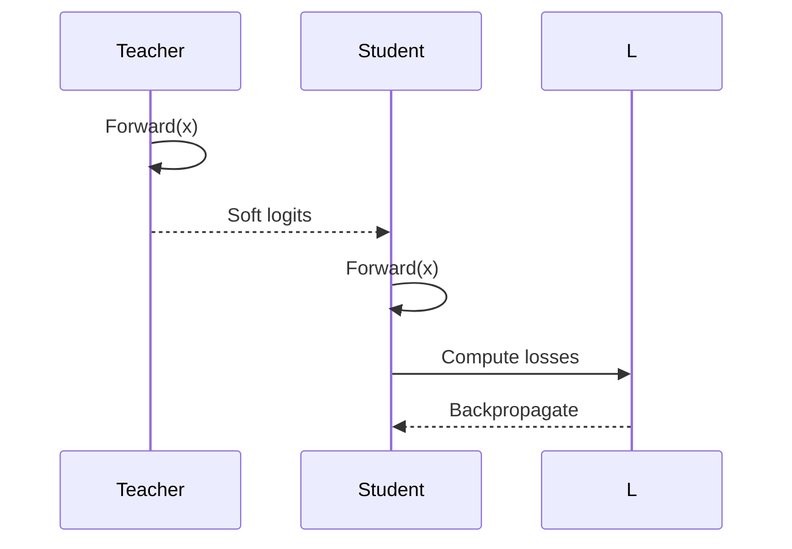

#### Operator fusion
Operator fusion combines a sequence of operations into one optimized kernel. When the model is put into evaluation mode and exported with TorchScript, the compiler can spot patterns such as a linear layer followed by activation and addition, then generate a fused kernel. Fewer kernels mean less launch overhead and better cache use.

```mermaid
flowchart TD
    subgraph Eager model
        A[Op1: Linear] --> B[Op2: ReLU] --> C[Op3: Add]
    end
    Eager model --> TS[TorchScript compile]
    TS --> F[Fused kernel executing Op1+Op2+Op3]
```

#### Key‑value cache
Transformer decoders repeatedly attend over previously generated tokens. A key‑value (KV) cache stores the key and value vectors from past time steps so that each new token only computes attention against the new vectors. The cache grows with sequence length, trading extra memory for reduced compute on long sequences.

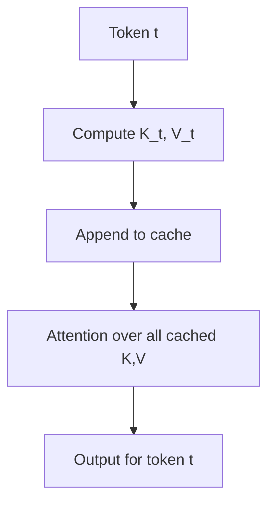

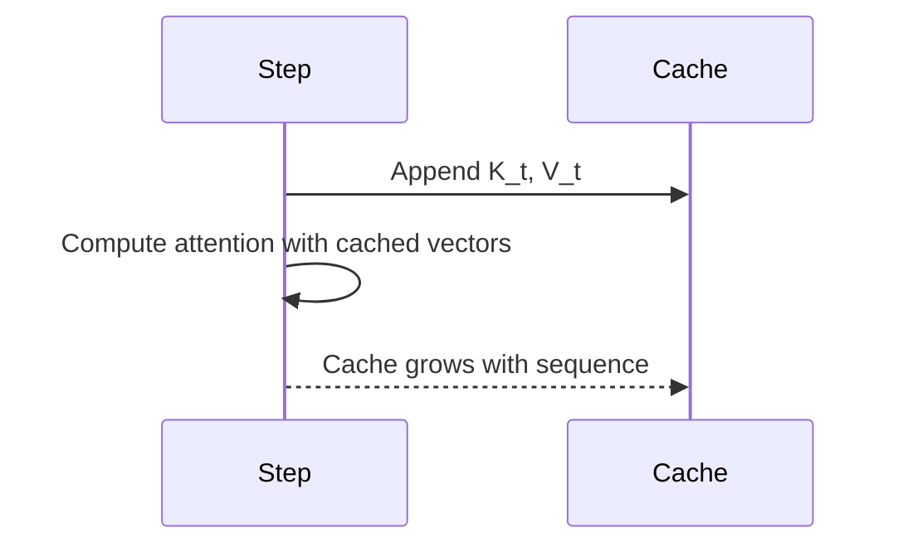

### Workflow overview

The following diagram summarizes the path from training through the various compression strategies to deployment:

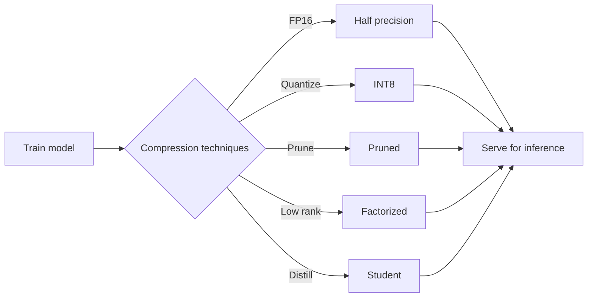

### KV‑cache flow

The KV‑cache reuses stored attention components during autoregressive decoding:

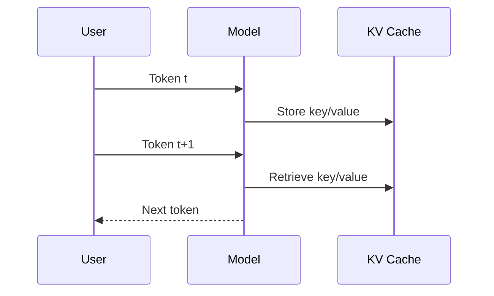

## Development

Run unit tests with:

```bash
uv run pytest
```

Lint and format staged files using pre‑commit:

```bash
uv run pre-commit run --files <files>
```

These checks also run automatically in GitHub Actions.

